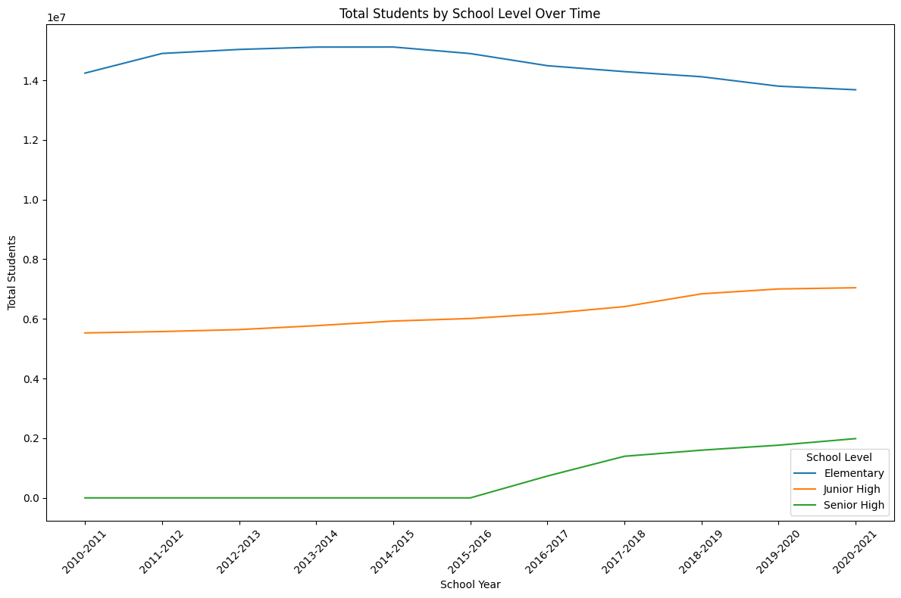
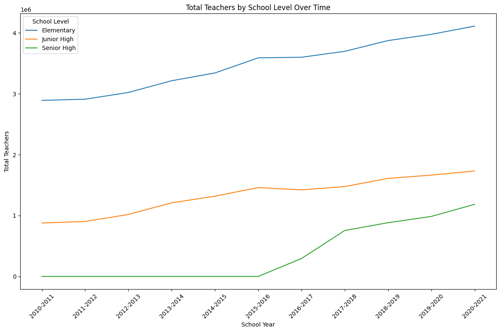

# Growth Trend Analysis Public Schools PH
A project dedicated to provide an analysis towards the dataset from Kaggle named [Philippine Public School Teachers and Students](https://www.kaggle.com/datasets/franksebastiancayaco/philippine-public-school-teachers-and-students?resource=download).

## **Key Findings**

The analysis of public school student and teacher populations in the Philippines reveals distinct trends over the last decade. The student population exhibits varied growth across different school levels, a trend not uniformly mirrored in the teacher population.

The Elementary student population, the largest of the three, showed a slight decline after the 2014-2015 school year. This contrasts with the consistent rise in both Junior and Senior High student populations.

Notably, the Senior High student population experienced a dramatic and rapid increase starting from the 2016-2017 school year. This significant growth is a direct reflection of the implementation of the K-12 program.

Across all levels, the overall teacher population demonstrated a consistent upward trend, which is a crucial point for further analysis of the teacher-to-student ratio. The data suggests that while the total number of teachers is increasing, the pace of that growth might not be uniform across all grade levels to accommodate the rapid student growth in newer programs.

**Methodology**
This project serves as a practical application of data analysis principles using Python and popular data science libraries. The process was as follows:

1. **Data Acquisition and Inspection**: Four separate CSV files for teachers, elementary, junior high, and senior high student populations were loaded. An initial inspection confirmed the need for data cleaning and transformation due to inconsistent formats.

2. **Data Transformation and Integration**: The teacher dataset was reshaped from a wide to a long format to align with the student data. Datasets were then standardized by addressing inconsistencies in the School Year format. A School Level column was added to the student data to serve as a key for merging.

3. **Data Cleaning and Consolidation**: All datasets were merged into a single final_df to facilitate a unified analysis. Missing values (NaN) were identified and handled to ensure the accuracy of all subsequent calculations and visualizations.

4. **Analysis and Visualization**: Key population trends were visualized using line plots, providing a clear view of student and teacher growth over time.
